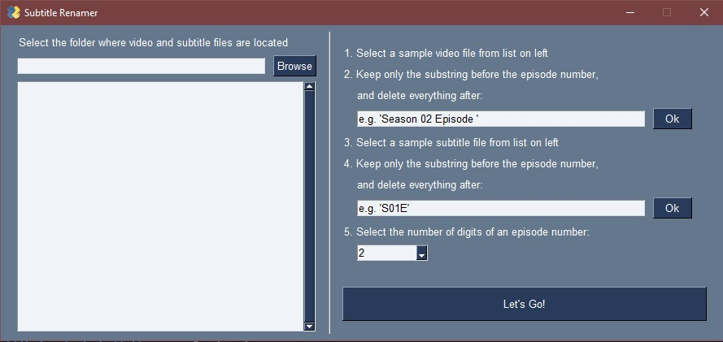
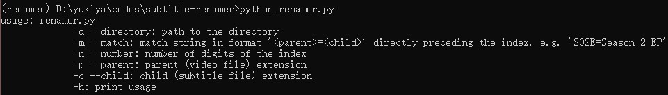

# Subtitle Renamer
A simple program to rename subtitle files to match the video files in the same directory.

## Environment
Python 3.8

## Install
1. Git clone: ```git clone https://github.com/way1998/subtitle-renamer.git```
2. Go to directory: ```cd subtitle-renamer```
3. Install dependencies: ```pip install -r requirement.txt```

## Run
1. Start GUI: ```python gui_renamer.py```
    
2. Or use command line interface: ```python renamer.py```
    
